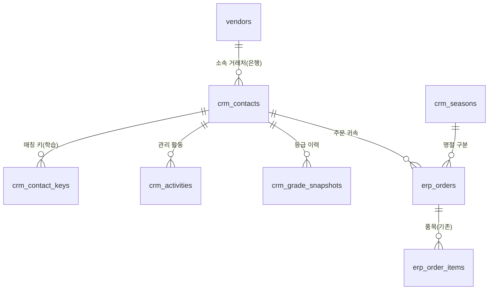

# 매출처 고객관리 설계안 (Customer Relationship Management)

> 목표: 엑셀 「(주)다올커머스 고객관리」(통계 시트)가 수작업으로 하던
> **"은행 지점 담당자 개인 단위의 관계 관리"** 를 시스템으로 옮긴다.
> 매출·연속성·친밀도 등급, 신규/이탈 추적, 관리 활동 이력을
> 기존 ERP 주문 데이터(`erp_orders`) 위에 얹는다.

작성일: 2026-07-23 · v1 · 상태: **설계안 (데이터 모델 중심, 구현 전 승인 대기)**

---

## 0. 현재 엑셀 관리 방식 (분석 결과)

원본: 고객관리 엑셀 (시트 4개 — 통계 / data / 2025 / 2026)

| 시트 | 내용 |
|---|---|
| `data` | 2024~2026 주문 원장 32,168행 (라인 단위). 은행/지점/담당자, 품명, 판매·매입금액, 마진율, 구분(상시·24설·24추석·25설·25추석·26설·샘플·선결제·VIP), 채널(다올 영업담당) |
| `2025`/`2026` | data의 연도별 사본 (중복) |
| `통계` | **고객 3,011명**(거래처+지점+담당자 조합) × 명절 5회 + 월별 30개월 매출을 SUMIFS로 집계, 등급 4종 산출 |

### 엑셀이 정의한 규칙 (수식에서 추출 — 시스템이 그대로 계승할 기준)

**고객 식별 키**: `은행명|지점명|담당자명` 문자열 결합 (`_키(상담자매칭용)` 컬럼).
담당자는 지점장 또는 실무자 중 한 명(둘 중 채워진 쪽).

**매출 집계 기준** (통계 시트 SUMIFS 조건):
- 금액 = `합계금액`(판매 기준, data!Q)
- 제외: `상태='cancel'`, 품명에 `선결제`·`퀵`·`택배비`·`배송비` 포함
- 버킷: 명절(구분=24설·24추석·25설·25추석·26설) + 상시(년·월별)

**등급 4종**:

| 등급 | 산출 | 기준 |
|---|---|---|
| 매출 | 자동 | 24~26 누적: A ≥ 1,000만 / B ≥ 500만 / C ≥ 100만 / D 그 미만 |
| 연속성 | 자동 | A: 24·25·26 명절 전부 + 24·25·26 상시 전부 거래 / B: 26 명절+26 상시 / C: 명절 3년 연속 or 상시 3년 연속 or 26 명절 or 26 상시 / D: 과거(24~25)만 거래 |
| 친밀도 | **수기** | A: 개인 폰 주문+지점 소개 / B: 개인 폰 주문 / C: 사무실 전화만 / D: 낮음 (3,011명 중 522명만 입력됨) |
| 종합 | 자동 | 세 등급을 A=4~D=1 점수화 → 평균 반올림 → 등급 환원 |

**신규/이탈**: 연도별 거래 여부 플래그 기반.
신규(Y년) = Y-1년 미거래 & Y년 거래 / 이탈(Y년) = Y-1년 거래 & Y년 미거래.
(엑셀 집계: 2025 신규 228·이탈 120, 2026 신규 102·이탈 217)

**한계 (시스템이 해결할 것)**:
1. 문자열 키라서 오타·직급 변경·지점 이동 시 같은 사람이 다른 고객으로 쪼개짐
2. 관리 활동 컬럼(키맨·현황·관리·최종 관리일)이 준비만 되고 전부 미사용
3. 친밀도 입력률 17% — 어떤 고객부터 채울지 우선순위 없음
4. 3,011행 × 수십 개 SUMIFS — 갱신·확장 부담

---

## 1. 설계 원칙 (기존 운영 원칙과의 정합)

- **자동 매칭은 추천까지만, 확정은 사용자** — 주문↔고객 연결도 `erp_vendor_aliases`와
  같은 "한 번 확정하면 학습되는 별칭" 패턴을 따른다.
- **병합에는 이력** — 고객(사람) 병합 시 키는 남기고 이력을 기록한다 (거래처 마스터 정책과 동일).
- **Drill-down** — 고객 화면의 모든 집계 숫자는 주문 라인(`erp_order_items`)까지 내려갈 수 있어야 한다.
- **회계 구조 불변** — CRM은 조회·관리 계층이다. 분개·원장·손익 로직은 건드리지 않는다.

---

## 2. 엔티티 모델



- **`crm_contacts`** — 고객 = 사람. 은행/지점은 "현재 소속" 표시용이고, 식별은 UUID.
  담당자가 지점을 옮겨도 같은 사람으로 유지된다 (엑셀 한계 1 해결).
- **`crm_contact_keys`** — 주문 원문(은행|지점|담당자)을 고객에 연결하는 학습 테이블.
  한 사람이 여러 키를 가질 수 있다 (오타 표기, 직급 변경 전/후, 이동 전/후 지점).
- **`crm_seasons`** — 명절 마스터 (24설~26추석…). 주문의 명절/상시 귀속 기준.
- **`erp_orders` 확장** — `season_code`(명절 구분), `crm_contact_id`(고객 귀속) 컬럼 추가.
- **`crm_activities`** — 관리 활동 이력 (엑셀의 현황/관리/최종 관리일을 대체).
- **`crm_grade_snapshots`** — 평가 시점별 등급 보존 (등급 변동·신규/이탈 추이 분석용).

---

## 3. 테이블 정의 (DDL 초안)

### 3-1. `crm_contacts` — 고객(사람) 마스터

```sql
CREATE TABLE crm_contacts (
  id              UUID DEFAULT gen_random_uuid() PRIMARY KEY,
  vendor_id       UUID REFERENCES vendors(id) ON DELETE SET NULL,  -- 거래처(은행) 마스터 연결
  bank_name       VARCHAR(100) NOT NULL,   -- 현재 소속 (표시용)
  branch_name     VARCHAR(100),            -- 현재 지점 (은행 아닌 일반 회사면 NULL)
  name            VARCHAR(100) NOT NULL,   -- 성함 (직급 제외: '안아영')
  title           VARCHAR(50),             -- 직급 ('차장' — 변동 가능하므로 분리)
  role            VARCHAR(20) DEFAULT 'staff'
                  CHECK (role IN ('staff', 'branch_manager')),  -- 실무자/지점장
  phone           VARCHAR(50),             -- 개인 연락처
  office_phone    VARCHAR(50),
  intimacy_grade  CHAR(1) CHECK (intimacy_grade IN ('A','B','C','D')),  -- 수기 입력
  keyman          VARCHAR(200),            -- 키맨(소개 루트)
  is_rotc         BOOLEAN,                 -- ROTC 여부(지점장) — NULL=미확인
  counselor_prev  VARCHAR(50),             -- 상담자(기존) — 엑셀 이관값 보존
  counselor_now   VARCHAR(50),             -- 상담자(현재) — 다올 담당 영업
  status          VARCHAR(20) DEFAULT 'active'
                  CHECK (status IN ('active', 'moved', 'left', 'merged')),
  merged_into_id  UUID REFERENCES crm_contacts(id),  -- 병합 시 승계 대상 (이력 보존)
  memo            TEXT,
  created_at      TIMESTAMPTZ DEFAULT now(),
  updated_at      TIMESTAMPTZ DEFAULT now()
);
```

### 3-2. `crm_contact_keys` — 주문 매칭 키 (학습)

```sql
CREATE TABLE crm_contact_keys (
  id            UUID DEFAULT gen_random_uuid() PRIMARY KEY,
  contact_id    UUID NOT NULL REFERENCES crm_contacts(id) ON DELETE CASCADE,
  bank_name     VARCHAR(100) NOT NULL,   -- 주문 원문 그대로 (정규화 전)
  branch_name   VARCHAR(100) NOT NULL DEFAULT '',
  manager_name  VARCHAR(100) NOT NULL,   -- 주문 원문 그대로 ('안아영 차장님')
  source        VARCHAR(10) NOT NULL DEFAULT 'manual'
                CHECK (source IN ('import', 'manual', 'auto')),
  created_at    TIMESTAMPTZ DEFAULT now(),
  UNIQUE (bank_name, branch_name, manager_name)
);
```

- 매칭 규칙: `erp_orders`의 (bank_name, branch_name, manager_name) 3요소 **정확 일치** → 자동 귀속.
  일치 없음 → 유사 후보 추천(기존 `name-similarity` 재사용) → 사용자가 확정하면 키가 추가돼 다음부터 자동.
- 사람 병합 시 키는 삭제하지 않고 `contact_id`만 승계 → 과거 주문 귀속이 그대로 유지된다.

### 3-3. `crm_seasons` — 명절 마스터

```sql
CREATE TABLE crm_seasons (
  code         VARCHAR(10) PRIMARY KEY,  -- '24설', '25추석', '26설' … (엑셀 구분값 그대로)
  label        VARCHAR(50) NOT NULL,     -- '2024년 설'
  season_type  VARCHAR(10) NOT NULL CHECK (season_type IN ('seol', 'chuseok')),
  year         SMALLINT NOT NULL,
  order_start  DATE NOT NULL,            -- 주문 수집 기간 (date 기반 추천용)
  order_end    DATE NOT NULL
);
```

### 3-4. `erp_orders` 컬럼 추가

```sql
ALTER TABLE erp_orders
  ADD COLUMN season_code    VARCHAR(10) REFERENCES crm_seasons(code),  -- NULL = 상시
  ADD COLUMN crm_contact_id UUID REFERENCES crm_contacts(id) ON DELETE SET NULL;
```

- `season_code` 결정: ① 업로드 파일에 구분 컬럼이 있으면 그대로 ② 없으면 주문일이
  시즌 기간(`order_start~order_end`)에 들면 **추천**만 하고 확정은 화면에서 (운영 원칙 준수 —
  시즌 기간 중에도 상시 주문이 실제로 존재하므로 날짜만으로 단정하지 않는다).
- `crm_contact_id` 채움: 매칭 RPC(멱등)가 `crm_contact_keys` 정확 일치 건을 일괄 귀속.
  재실행해도 결과 동일.

### 3-5. `crm_activities` — 관리 활동 이력

```sql
CREATE TABLE crm_activities (
  id             UUID DEFAULT gen_random_uuid() PRIMARY KEY,
  contact_id     UUID NOT NULL REFERENCES crm_contacts(id) ON DELETE CASCADE,
  activity_date  DATE NOT NULL,
  activity_type  VARCHAR(20) NOT NULL
                 CHECK (activity_type IN ('call','visit','kakao','gift','sample','order_followup','etc')),
  staff_name     VARCHAR(50),        -- 다올 담당 직원
  summary        VARCHAR(300),       -- 한 줄 요약
  memo           TEXT,
  next_action_date DATE,             -- 다음 할 일 (팔로업 알림 기준)
  next_action_memo VARCHAR(300),
  created_at     TIMESTAMPTZ DEFAULT now(),
  updated_at     TIMESTAMPTZ DEFAULT now()
);
```

- 고객의 **최종 관리일** = `MAX(activity_date)` (별도 컬럼으로 들고 다니지 않는다 — 정합 유지).
- `next_action_date`가 지난 활동 = "팔로업 필요" 목록의 원천.

### 3-6. `crm_grade_snapshots` — 등급 스냅샷 (이력)

```sql
CREATE TABLE crm_grade_snapshots (
  id               UUID DEFAULT gen_random_uuid() PRIMARY KEY,
  contact_id       UUID NOT NULL REFERENCES crm_contacts(id) ON DELETE CASCADE,
  eval_month       VARCHAR(7) NOT NULL,   -- 'YYYY-MM' 평가 기준월
  revenue_grade    CHAR(1) NOT NULL,      -- 계산값 고정 보존
  continuity_grade CHAR(1) NOT NULL,
  intimacy_grade   CHAR(1),               -- 당시 수기값 복사
  overall_grade    CHAR(1) NOT NULL,
  total_revenue    BIGINT NOT NULL DEFAULT 0,  -- 평가 시점 누적 매출
  created_at       TIMESTAMPTZ DEFAULT now(),
  UNIQUE (contact_id, eval_month)
);
```

- 현재 등급은 항상 실시간 계산(아래 §4). 스냅샷은 **월 1회 저장해 변동 추이·신규/이탈
  리포트의 재현성**을 보장하는 용도 (엑셀에는 없던 기능).

### 3-7. `crm_legacy_sales` — 엑셀 과거 매출 집계 (2024년 등 DB 미보유 기간)

현재 DB의 `erp_orders`는 **2025-01-01 ~ 2026-07-13**만 보유한다 (사장님 확인).
그러나 연속성 등급(최근 3개년)과 2025년 신규/이탈 판정에는 2024년 거래 사실이 필요하다.
2024년 엑셀 원장(9,651행)은 주문번호가 없어 `erp_orders`로 넣을 수 없고,
회계 흐름(수금·정산·분개)에 섞여서도 안 되므로 **CRM 전용 집계 테이블**로 1회 이관한다.

```sql
CREATE TABLE crm_legacy_sales (
  id           UUID DEFAULT gen_random_uuid() PRIMARY KEY,
  contact_id   UUID NOT NULL REFERENCES crm_contacts(id) ON DELETE CASCADE,
  -- 명절 버킷이면 season_code, 상시 버킷이면 sales_month 중 하나만 채움
  season_code  VARCHAR(10) REFERENCES crm_seasons(code),
  sales_month  VARCHAR(7),              -- 'YYYY-MM' (상시)
  amount       BIGINT NOT NULL,         -- 엑셀 매출 인정 규칙 적용 후 합계
  source       VARCHAR(50) NOT NULL DEFAULT 'excel-2024',  -- 이관 출처 표기
  created_at   TIMESTAMPTZ DEFAULT now(),
  UNIQUE (contact_id, season_code, sales_month),
  CHECK ((season_code IS NULL) <> (sales_month IS NULL))
);
```

- 등급·신규/이탈 RPC는 `erp_orders`(2025~) + `crm_legacy_sales`(2024)를 UNION해 집계한다.
- 라인이 아닌 집계값이므로 drill-down은 "엑셀 이관값(2024)" 배지로 표시하고 라인 추적은 하지 않는다.
- 2024년은 마감된 과거라 재이관·갱신이 없다 (1회성, `source`로 추적).

---

## 4. 등급 산정 (실시간 계산 RPC)

`crm_contact_stats(p_from, p_to)` — 고객별 매출 버킷과 등급을 단일 집계 쿼리로 반환
(3,011행 SUMIFS의 대체. `erp_orders_summary` 패턴과 동일하게 DB에서 집계).

**매출 인정 라인** (엑셀 규칙 계승 + 기존 순매출 규칙과 통일 — 2026-07-23 사장님 확정):

```
erp_order_items 중
  NOT is_canceled
  AND NOT is_prepayment              -- 엑셀 '선결제' 제외와 동일
  AND NOT is_vip                     -- 기존 순매출 규칙과 동일 (확정 #2)
  AND COALESCE(order_kind, '') <> '샘플'   -- 샘플 제외 (확정 #3) — 금액·거래여부 판정 모두
  AND item_name NOT LIKE '%퀵%'
  AND item_name NOT LIKE '%택배비%'
  AND item_name NOT LIKE '%배송비%'
의 line_total 합
```

> 참고 — 기존 순매출 규칙(`erp_orders_summary`, 020): 취소(`is_canceled`) ·
> VIP(`is_vip`: 품명='VIP'이고 판매가=매입가, 업로드 시 판정) · 선결제(`is_prepayment`)
> 라인을 순매출에서 제외. CRM 매출도 같은 플래그를 그대로 쓰고, 여기에
> 엑셀 고객관리 고유의 배송비류·샘플 제외를 더한 것이다.

**버킷**: 주문의 `season_code`가 있으면 해당 명절, 없으면 상시(주문 연·월).

**등급 규칙** (§0의 엑셀 기준을 그대로 SQL CASE로):
- 매출: 조회 기간 누적 ≥ 1,000만 A / ≥ 500만 B / ≥ 100만 C / 그 외 D
- 연속성: 연도별 명절 거래 여부 × 상시 거래 여부 조합 (§0 표 기준).
  엑셀은 24~26 고정이었으나 RPC는 **기준일로부터 최근 3개년**으로 일반화한다
  (해가 바뀌어도 수식 수정 없이 동작).
- 친밀도: `crm_contacts.intimacy_grade` (수기)
- 종합: A=4~D=1 평균 반올림 (친밀도 미입력 시 매출·연속성 2개 평균 — 엑셀과 동일하게
  미입력을 0점 취급하지 않는다)

**신규/이탈 RPC**: 연도별 거래 여부(위 매출 인정 라인 존재)로
신규 = 전년 X & 당년 O / 이탈 = 전년 O & 당년 X. 목록과 인원수 모두 반환 (drill-down).

---

## 5. 초기 데이터 이행 (엑셀 → 시스템)

| 순서 | 작업 | 원천 | 대상 |
|---|---|---|---|
| ① | 명절 마스터 시드 | 구분값 (24설~26설) + 실제 주문일 분포로 기간 산정 | `crm_seasons` |
| ② | 고객 3,011명 임포트 | 통계 시트 상세 (거래처·지점·지점장·실무자·상담자·친밀도 522건) | `crm_contacts` + `crm_contact_keys`(source='import') |
| ③ | 주문 매칭 | `crm_contact_keys` 정확 일치 | `erp_orders.crm_contact_id` (2025-01~2026-07 보유분) |
| ④ | 시즌 백필 | data 시트의 구분 컬럼 ↔ `erp_orders` 대응 건 | `erp_orders.season_code` |
| ⑤ | 2024년 과거 매출 이관 | data 시트 2024년 9,651행 → 매출 인정 규칙 적용 후 고객×버킷 집계 | `crm_legacy_sales` |
| ⑥ | 검증 보고서 | 엑셀 통계 시트 집계값 vs RPC 결과 대조 (등급 분포·신규/이탈 수) | — |

- ②에서 담당자 원문("안아영 차장님")은 키에 보존하고, `name`/`title` 분리는 파싱 추천 +
  일괄 확인 화면으로 처리 (자동 확정 금지).
- ⑥이 이 설계의 **검증 기준**: 엑셀 결과(매출등급 A 188 · B 246 · C 1,079 · D 1,498,
  2025 신규 228/이탈 120, 2026 신규 102/이탈 217)를 시스템이 재현하거나 차이 원인을 전부 규명.
  단, VIP·샘플 제외 규칙이 엑셀 SUMIFS와 다르게 확정되었으므로(§4) 그로 인한 차이는
  건별로 분리해 보고한다 (엑셀 기준 재현 → 확정 규칙 적용 순으로 2단 검증).

---

## 6. 화면 (개요만 — 상세는 구현 단계)

1. **고객 목록** — 등급 필터(매출·연속성·친밀도·종합), 상담자 필터, 최종 관리일 경과 정렬
2. **고객 상세** — 명절·월별 매출 그리드(엑셀 통계 행 재현) + 주문 drill-down + 활동 타임라인 + 등급 추이
3. **매칭 관리** — 미귀속 주문 키 목록 → 기존 고객 연결 or 신규 생성 (별칭 화면 패턴 재사용)
4. **관리 워크리스트** — 팔로업 도래·이탈 위험(전년 거래 & 당년 미거래 & 명절 임박)·친밀도 미입력 상위 고객

---

## 7. 확정 사항 (2026-07-23 사장님)

1. **주문 데이터 커버리지**: DB는 **2025-01-01 ~ 2026-07-13**만 보유 →
   2024년은 엑셀에서 `crm_legacy_sales`로 1회 이관 (§3-7). 2025-01 이후는
   `erp_orders`가 유일한 원천 (엑셀 data 시트와의 건수·금액 대조는 검증 ⑥에서 수행).
2. **VIP 제외 확정** — 기존 순매출 규칙(취소·VIP·선결제 제외, `erp_orders_summary`)을
   그대로 따른다. VIP 판정: 품명='VIP'이고 판매가=매입가(업로드 시 `is_vip` 플래그).
3. **샘플 제외 확정** — 금액 집계와 거래 여부(연속성·신규/이탈) 판정 모두에서 제외.
4. **친밀도 입력 우선순위** — 매출 A·B등급 & 2026년 거래 고객부터. 관리 워크리스트
   화면(§6-4)의 기본 정렬에 반영한다.

---

## 8. 구현 위치와 배포 형태

이 시스템은 **별도 프로그램이 아니라 기존 회계 웹앱(`my-accounting-app`)에 메뉴로 추가**된다.

| 계층 | 위치 |
|---|---|
| DB | Supabase(PostgreSQL) — 기존 프로젝트에 마이그레이션 추가 (`supabase/migrations/069_crm_*.sql`~) |
| 집계 | PostgreSQL RPC (기존 `erp_orders_summary` 패턴 — 서버에서 단일 쿼리 집계) |
| API | Next.js Route Handler `app/api/crm/*` |
| 화면 | Next.js 대시보드 `app/(dashboard)/crm/*` — 브라우저로 접속하는 기존 앱 화면 |
| 접근 | 기존 로그인/사이드바 그대로. 사이드바에 **"고객관리" 그룹** 신설 |

화면 라우트 (기존 `/customers`(매출처 수금현황)와 별개 — 그쪽은 회사 단위 수금 관리,
CRM은 사람 단위 관계 관리):

- `/crm` — 고객 목록 (등급·상담자 필터, 최종 관리일 정렬)
- `/crm/[id]` — 고객 상세 (명절·월별 매출 그리드, 활동 타임라인, 등급 추이)
- `/crm/matching` — 미귀속 주문 매칭 (별칭 화면 패턴)
- `/crm/worklist` — 관리 워크리스트 (팔로업 도래·이탈 위험·친밀도 미입력 우선순위)

기존 화면과의 연결: `/customers`·`/reports/vendor-sales`의 거래처 행에서 해당
거래처 소속 고객 목록(`/crm?vendor=`)으로 이동하는 링크를 추가한다.

---

## 9. 기존 시스템과의 충돌 검토 (2026-07-23 코드 확인)

CRM은 기존 데이터를 **읽기만** 하고(분개·원장·수금 로직 무변경), 쓰기는 신규 테이블과
`erp_orders`의 추가 컬럼 2개뿐이다. 실제 코드로 확인한 충돌 지점과 대응:

| # | 지점 | 확인 결과 | 대응 |
|---|---|---|---|
| 1 | **재업로드 시 품목 삭제·재생성** — ERP 임포트는 `erp_order_items`를 DELETE 후 INSERT (item id가 매번 바뀜, `settlement_month`만 별도 보존) | CRM이 품목 id를 참조하면 재업로드마다 끊어짐 | **설계 원칙: CRM은 `erp_order_items`에 FK·컬럼을 일절 두지 않는다.** 귀속 정보는 전부 주문(`erp_orders`) 레벨(`season_code`, `crm_contact_id`)과 별도 crm_* 테이블에만 둔다 (현 설계 그대로) |
| 2 | **재업로드 시 주문 upsert** — `onConflict: 'order_no'`로 임포트가 보내는 컬럼만 갱신 | 추가 컬럼(`season_code`, `crm_contact_id`)은 payload에 없으므로 **보존됨** | 단, 재업로드로 은행/지점/담당자명이 바뀔 수 있음 → 매칭 RPC는 "키 3요소가 현재 매칭 키와 불일치하면 `crm_contact_id` 재평가"까지 포함해 멱등으로 설계 (NULL 건만 채우는 방식 금지) |
| 3 | **RLS** (064) — 전 테이블 RLS 활성, 정책 없음(서버 API가 service_role로 접근) | 신규 테이블도 같은 전제 | crm_* 마이그레이션에서 `ENABLE ROW LEVEL SECURITY`만 걸고 정책은 만들지 않는다 (기존 관례 동일) |
| 4 | **거래처 병합** (055 `merge_vendors`) — 참조 테이블들의 `vendor_id`를 명시적으로 승계 | `crm_contacts.vendor_id`는 병합 목록에 없음 → 병합 시 고아 참조 발생 | 마이그레이션에서 `merge_vendors` RPC에 `UPDATE crm_contacts SET vendor_id = p_into WHERE vendor_id = p_from` 1줄 추가 (기존 패턴과 동일) |
| 5 | **마이그레이션 번호** | 현재 068까지 사용 | 069부터 사용 |
| 6 | **updated_at 트리거** | 공용 함수 `update_updated_at_column()` 존재 | 재사용 (신규 정의 금지) |
| 7 | **화면/API 네임스페이스** | `/customers`, `/api/customers` 사용 중 (회사 단위 수금) | CRM은 `/crm`, `/api/crm`으로 분리 — 라우트 충돌 없음 |
| 8 | **성능** | 3만+ 행 매칭 UPDATE | `erp_orders(bank_name, branch_name, manager_name)` 복합 인덱스 + `crm_contact_id`·`season_code` 인덱스 추가. 집계는 RPC 단일 쿼리(기존 패턴)라 화면 영향 없음 |

**회계 무결성**: CRM은 journal/ledger/수금(`collect_status`)/정산(`settlement_month`)에
쓰기를 하지 않으므로 이중계상·분개 정합에 영향이 없다. 유일한 기존 테이블 변경은
`erp_orders`에 nullable 컬럼 2개 추가이며, 기존 조회·집계 RPC는 컬럼을 명시 선택하므로 무영향.
